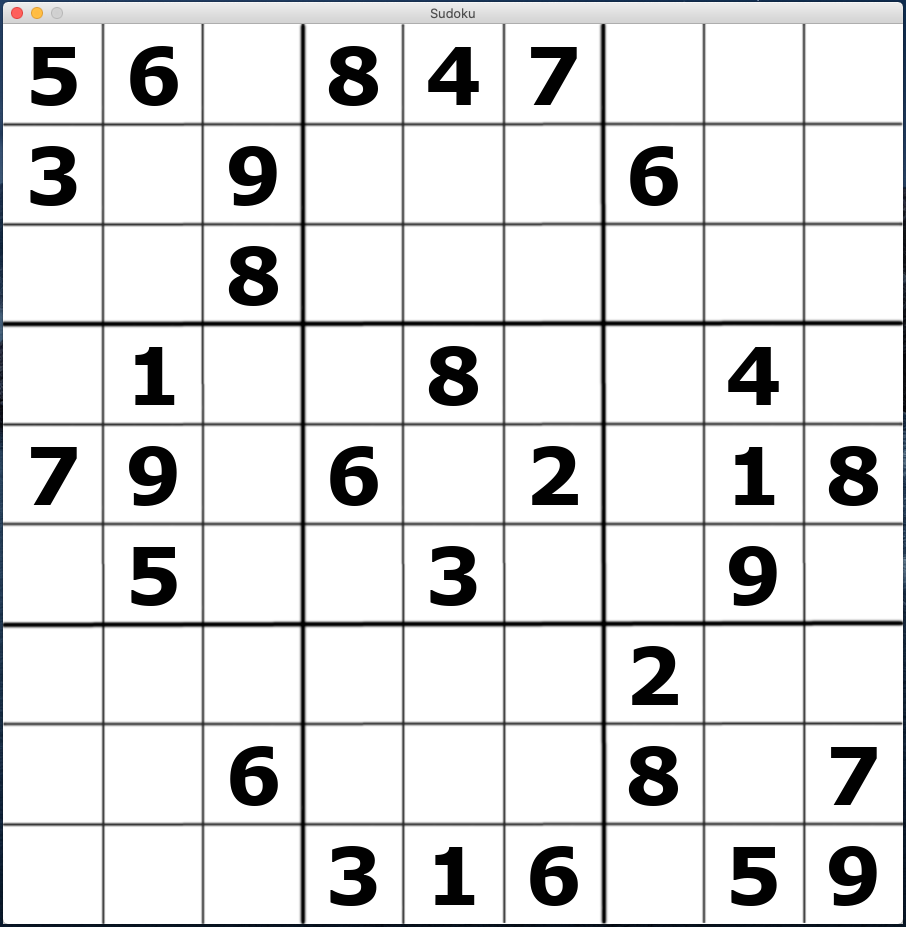

# Sudoku
A Python application that allows users to play a game of Sudoku. Additionally, utilizes a recursive backtracking algorithm to auto-completed incomplete, solvable boards.

- Controls:
	- Mouse-Click: Select tiles to input values on. Values can be inputted via the number keys 1-9
	- Enter: Submit values, such that they are checked for accuracy. Correct values will remain, while incorrect values will be highlighted red.
	- Space: Initiates backtracking algorithm, which will auto-solve the remainder of the unsolved board.

# Information
This application is a work-in-progress and was created as a means to work on my understanding of recursive functions, as well as GUI development.
# Room for Improvement
- UI Design - There are many areas in which the UI can be improved, some of which include: more accurate drawing, an indication of which square is selected, and a more obvious denotion of correct value placements. 
- Start Page - An initial start page can be created, which denotes controls.
- Board Input - Currently works only with the board that is hard-coded into the program. I will eventually create a UI that allows users to setup their own, unique board prior to the game starting.
# Screenshots

# Notes
Currently, the pygame library is quite laggy on macOS. This program is run ideally on Windows 10.
